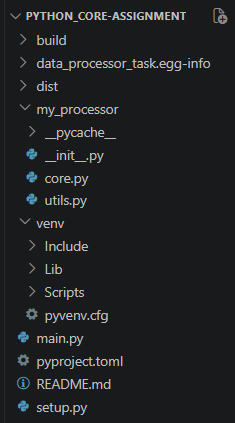
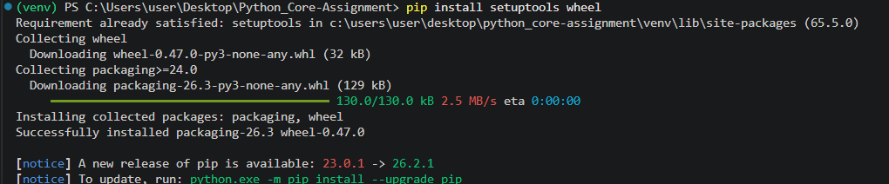
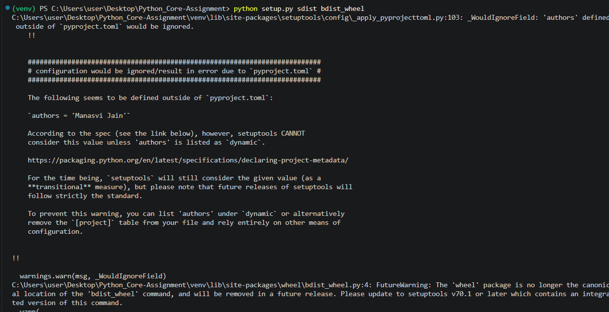
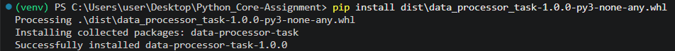
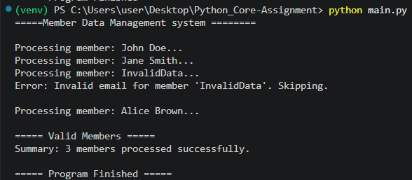

# Core Python Training Assignment

# Project Overview

The **Member Data Management System** is a Python project developed as part of the Core Python Training Assignment.
The application processes a list of member records, validates the data using Regular Expressions, handles invalid records using custom exceptions, and demonstrates various core Python concepts. The project is packaged into a Python Wheel (.whl) file for distribution.

---

# Technologies Used

```
• Python 3.10.11
• Setuptools
• Wheel
```
---

# Project Structure

```
Python_Core_Assignment/
│
├── main.py
├── setup.py
├── pyproject.toml
├── README.md
│
└── my_processor/
    ├── __init__.py
    ├── core.py
    └── utils.py
```


---

# Features

```
• Stores member information using dictionaries.
• Uses lists to manage multiple members.
• Cleans raw input data.
• Validates email addresses using Regular Expressions.
• Validates phone numbers.
• Uses a custom exception for invalid data.
• Uses Lambda and Filter functions.
• Creates a Python Wheel package.
```

---

# Requirements

Install the required packages:

```bash
pip install setuptools wheel
```


---

# Build the Wheel File

Run the following command:

```bash
python setup.py sdist bdist_wheel
```


After successful execution, a **dist** folder will be created containing:

```
data_processor_task-1.0.0-py3-none-any.whl
```

---

# Install the Wheel File

```bash
pip install dist\data_processor_task-1.0.0-py3-none-any.whl
```


---

# How to Run the Project

Open the terminal inside the project folder and run:

```bash
python main.py
```
---

# Sample Output

```
Processing member: John Doe... Validation Successful.
Processing member: Jane Smith... Validation Successful.

Error: Invalid email for member 'InvalidData'. Skipping.
Summary: 2 members processed successfully.

```


---

# Author

**Name:** Manasvi Jain